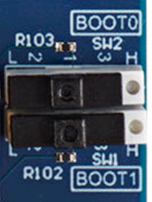

# Audio Getting Started Package

This project provides an STM32 Microcontroler embedded real time environement
to execute [X-CUBE-AI](https://www.st.com/en/embedded-software/x-cube-ai.html)
generated model targetting audio applications. The purpose of this package is to
stream physical data acquired by sensors into a processing chain including a
preprocessing step that typically would perform a first level of feature
extraction, the machine learning inference itself, and a post processing step
before exposing the results to the user in real time. The project implements
both RTOS and bare metal versions. A low power version is also provided.

## Table of Contents

- [Audio Getting Started Package](#audio-getting-started-package)
  - [Table of Contents](#table-of-contents)
  - [Hardware and Software environment](#hardware-and-software-environment)
    - [Hardware support](#hardware-support)
    - [Boot modes](#boot-modes)
    - [Serial port configuration](#serial-port-configuration)
    - [Toolchains support](#toolchains-support)
  - [Quickstart using prebuilt binaries](#quickstart-using-prebuilt-binaries)
  - [Quickstart using Source Code - AED](#quickstart-using-source-code---aed)
    - [Application Build and Run - Dev Mode](#application-build-and-run---dev-mode)
      - [STM32CubeIDE](#stm32cubeide)
      - [Makefile](#makefile)
    - [Application Build and Run - Boot from Flash](#application-build-and-run---boot-from-flash)
      - [Build the Application](#build-the-application)
        - [STM32CubeIDE](#stm32cubeide-1)
        - [Makefile](#makefile-1)
      - [Program the Firmware in the External Flash](#program-the-firmware-in-the-external-flash)
  - [Typical Output on uart console](#typical-output-on-uart-console)
  - [Model Deployment](#model-deployment)
    - [Model zoo deployment](#model-zoo-deployment)
    - [Manual deployment](#manual-deployment)
  - [Configuration](#configuration)
    - [Application](#application)
    - [AED example](#aed-example)
    - [SE example](#se-example)
  - [How to update my project with a new version of ST Edge AI](#how-to-update-my-project-with-a-new-version-of-st-edge-ai)
  - [Know issues and Limitations](#know-issues-and-limitations)

## Hardware and Software environment

### Hardware support

- MB1939 STM32N6570-DK board
  - The following OTP fuses must be set
    - VDDIO2_HSLV=1     I/O XSPIM_P1 High speed option enabled
    - VDDIO3_HSLV=1     I/O XSPIM_P2 High speed option enabled
  - *Warning*: when OTP fuses are set, they can not be reset.
  - *Warning*: when executing the project on the board, these two OTP fuses are
   set if not already

### Boot modes

The STM32N6 series does not have internal flash memory. To retain firmware after
a reboot, program it into the external flash. Alternatively, you can load
firmware directly into SRAM (development mode), but note that the program will
be lost if the board is powered off in this mode.

Development Mode: used for loading firmware into RAM during a debug session or
for programming firmware into external flash.

Boot from Flash: used to boot firmware from external flash.

|                  | STM32N6570-DK                                                                |
| -------------    | -------------                                                                |
| Boot from flash  |  |
| Development mode |        |


More details about it in [Boot-Overview.md](Doc/Boot-Overview.md) doc.

### Serial port configuration

This package outputs results and useful information (depending on the configured
level of verbosity) through a serial connection. The default configuration of
the serial link is:

- Speed = 14400 bauds
- Data = 8 bit
- Parity = None
- Stop bit = 1 bit
- Flow control = none

### Toolchains support

- [STM32CubeIDE](https://www.st.com/content/st_com/en/products/development-tools/software-development-tools/stm32-software-development-tools/stm32-ides/stm32cubeide.html) (__v2.10.0__)
- [STM32CubeProgrammer](https://www.st.com/en/development-tools/stm32cubeprog.html) (__v2.22.0__)
- [STEdgeAI](https://www.st.com/en/development-tools/stedgeai-core.html) (__v4.0.0__)

## Quickstart using prebuilt binaries

Two use cases are provided as examples:

  1. Audio Event Detection (aed): Automatically recognizing events like a baby
   crying or a clock tick.
  2. Speech Enhancement (se): Improve quality and intelligibility of speech
   signals, especially in noisy environments.

For each use case one binary is provided for the given combination of
bare metal (bm), freertos (freertos), bare metal low power (bm_lp) and freertos
low power (freertos_lp):

- `Binary/STM32N6570-DK/STM32N6_GettingStarted_Audio_aed_bm.hex`
- `Binary/STM32N6570-DK/STM32N6_GettingStarted_Audio_aed_bm_lp.hex`
- `Binary/STM32N6570-DK/STM32N6_GettingStarted_Audio_aed_freertos.hex`
- `Binary/STM32N6570-DK/STM32N6_GettingStarted_Audio_aed_freertos_lp.hex`
- `Binary/STM32N6570-DK/STM32N6_GettingStarted_Audio_se_bm.hex`
- `Binary/STM32N6570-DK/STM32N6_GettingStarted_Audio_se_bm_lp.hex`
- `Binary/STM32N6570-DK/STM32N6_GettingStarted_Audio_se_freertos.hex`
- `Binary/STM32N6570-DK/STM32N6_GettingStarted_Audio_se_freertos_lp.hex`

To program the wanted binary in the external flash of the board you must follow
the given procedure:

  1. Switch both switches to the right position
  2. Program `Binary/STM32N6_GettingStarted_Audio_[aed,se]_[bm,freertos]_[,lp].hex`
  3. Switch both switches to the left position
  4. Power cycle the board

After added your own `STM32_Programmer_CLI` in your PATH.
(`STM32_Programmer_CLI` can be found in STM32CubeIDE install at `<Installed Folder>/stm32cubeide_1.17.0/plugins/com.st.stm32cube.ide.mcu.externaltools.cubeprogrammer.<xxx version>/tools/bin/STM32_Programmer_CLI`)

Execute `flash-bin.sh` with two arguments:

  1. the use case (se/aed)
  2. the build configuration (bm/bm_lp/freertos/freertos_lp)

For example:
`flash-bin.sh aed bm_lp`

After setting in [Boot from flash](#boot-modes) and power cycle you should get
the results in the uart console.

If AED example is run, when the signal level is above a certain threshold,
different types of audio events can be detected ('crying_baby', 'clock_tick',
'sneezing', ...). You can play sound samples corresponding to these events to
test the system.

If SE example is run, you can hear the enhanced audio signal on the headset jack.
You can also compare it with the raw audio signal by bypassing the audio
processing pressing USER1 Button.

## Quickstart using Source Code - AED

The default model provided is an Audio Event Detection model.
Before building and running the application, you must program 
`Projects/X-CUBE-AI/models/aed_weights.hex` (model weights and biases).
This only needs to be done once unless you change the AI model. 
See [Quickstart using prebuilt binaries](#quickstart-using-prebuilt-binaries)
for details.

For more information about boot modes, see [Boot Overview](Doc/Boot-Overview.md).

### Application Build and Run - Dev Mode

Set your board to [development mode](#boot-modes).

#### STM32CubeIDE

Double-click `Projects/GS/STM32CubeIDE/.project` to open the project in
STM32CubeIDE. Build and run the project of the desired configuration (bm,
freertos, bm_lp, freertos_lp).

#### Makefile

Navigate to `Projects/GS` and run the following commands (ensure required tools
are in your PATH):

1. Build the project:

  ```bash
  make <bm/bm_lp/freertos/freertos_lp> -j8
  ```

2. Start a GDB server connected to the STM32 target:

  ```bash
  ST-LINK_gdbserver -p 61234 -l 1 -d -s -cp <path-to-stm32cubeprogramer-bin-dir> -m 1 -g
  ```

3. In a separate terminal, launch a GDB session to load the firmware:

  ```bash
    $ arm-none-eabi-gdb BuildGCC/<BM/BM_LP/FREERTIS/FREERTOS_LP>/GS_Audio_N6.elf
    (gdb) target remote :61234
    (gdb) monitor reset
    (gdb) load
    (gdb) continue
    ```

### Application Build and Run - Boot from Flash

Set your board to [development mode](#boot-modes).

#### Build the Application

##### STM32CubeIDE

Double-click `Projects/GS/STM32CubeIDE/.project` to open the project in STM32CubeIDE. Build and run the project.

##### Makefile

Ensure all required tools are in your PATH, then build the project with a given configuration:

- bare metal (bm)
- freertos (freertos)
- bare metal low power (bm_lp)
- freertos low power (freertos_lp)

```bash
make <bm/bm_lp/freertos/freertos_lp> -j8
```

#### Program the Firmware in the External Flash

After building the application, you must sign the binary file:

```bash
STM32_SigningTool_CLI -bin Projects/GS/BuildGCC/<BM/BM_LP/FREERTIS/FREERTOS_LP>/GS_Audio_N6.bin -nk -t ssbl -hv 2.3 -o Projects/GS/BuildGCC/<BM/BM_LP/FREERTIS/FREERTOS_LP>/GS_Audio_N6_sign.bin
```

Program the signed binary at address `0x70100000`, as well as the FSBL and network parameters.

On STM32N6570-DK:

```bash
export DKEL="<STM32CubeProgrammer_N6 Install Folder>/bin/ExternalLoader/MX66UW1G45G_STM32N6570-DK.stldr"

# First Stage Boot Loader
STM32_Programmer_CLI -c port=SWD mode=HOTPLUG -el $DKEL -hardRst -w FSBL/ai_fsbl.hex

# Adjust build path as needed
STM32_Programmer_CLI -c port=SWD mode=HOTPLUG -el $DKEL -hardRst -w Projects/GS/BuildGCC/<BM/BM_LP/FREERTIS/FREERTOS_LP>/GS_Audio_N6_sign.bin 0x70100000

# Network parameters
STM32_Programmer_CLI -c port=SWD mode=HOTPLUG -el $DKEL -hardRst -w Projects/X-CUBE-AI/models/aed_weights.hex
```

## Typical Output on uart console

Typical output seen on the uart console (baud rate = 14400):

```text
------------------------------------------------------------
        System configuration (Bare Metal)
------------------------------------------------------------

Log Level: Info

Compiled with GCC 13.3.1
STM32 device configuration...
 Device       : DevID:0x0486 (STM32N6) RevID:0x0000
 Core Arch.   : M55 - FPU  used
 HAL version  : 0x01010000
 SYSCLK clock : 600 MHz
 HCLK clock   : 400 MHz
 CACHE conf.  : $I/$D=(True,True)

NPU Runtime configuration...
 NPU clock    : 800 MHz
 NIC clock    : 800 MHz

ATONN Model
------------------------------------------------------------
 name          : network
 n_epochs      : 39
 params        : 0 KiB
 activations   : 144 KiB
 n_inputs      : 1
 name    : Input_0_out_0
  addr   : 0x34350000 (6144 bytes)  (8 bits)
  type   : 3 shape(4)=(1,64,96,1)
  quant  : scale=0.030531, zp=33
 n_outputs     : 1
 name    : Softmax_100_out_0
  addr   : 0x34350410 (40 bytes)  (32 bits)
  type   : 1 shape(4)=(1,1,1,10)

Preprocessing
------------------------------------------------------------
MEL spectrogram 64 mel x 96 col
- sampling freq : 16000 Hz
- acq period    : 960 ms
- window length : 400 samples
- hop length    : 160 samples

Postprocessing
------------------------------------------------------------
None

------------------------------------------------------------
# Start Processing
------------------------------------------------------------
                    | Frame   |  Cpu  |  Pre |  AI  | Post |
                    | 7       |  1.98%|  0.71|  1.26|  0.00|
{"class":"clock_tick"}
                    | 8       |  1.98%|  0.71|  1.26|  0.00|
{"class":"clock_tick"}
                    | 9       |  1.98%|  0.71|  1.26|  0.00|
{"class":"sneezing"}
                    | 10      |  1.98%|  0.71|  1.26|  0.00|
{"class":"clock_tick"}
```

Two extra features are implemented:

1. *Random load generation* demonstrates system availiblity for additional
flexible parallel processing. This feature is not available in bare metal
implementation.
2. *Bypass audio processing* allows the user to appreciate the benefit of audio
processing by comparing when the audio is directly looped back on the headset
without any AI processing. This feature is relevant to speech enhancemnent (SE)
only.

Depending on configuration user button allocations are as follow:

| Configuration             | USER1 Button      | TAMP Button            |
|:------------------------- |:------------------|:---------------------- |
| AED BM or BM-LP           | N/A               | N/A                    |
| AED FREERTOS or FREERTOS-LP           | N/A               | Random load generation |
| SE  FREERTOS or FREERTOS-LP           | Bypass audio proc | Random load generation |
| SE  BM or BM-LP           | Bypass audio proc | N/A                    |

Note that:

  1. Random load generation results in fast red LED blinking
  2. Bypass results audio in red LED toggling
  3. Green LED toggles at each audio patch acquisition

## Model Deployment

This Getting Started includes all the application code and libraries with aed as default config.

The python scripts provided in model zoo can modif the app to deploy another model. You can either use the [Model zoo](#model-zoo-deployment) or the [manual deploymennt](#manual-deployment) provided in the package.

### Model zoo deployment

After training and compiling the model designed for an STM32N6, the deployment
phase will make use of the following paremeters included in user configuration
*yaml* file:

```yaml
general:
  project_name: aed_project
  model_path: <model_zoo>/audio_event_detection/yamnet/ST_pretrainedmodel_public_dataset/esc10/yamnet_1024_64x96_tl/yamnet_1024_64x96_tl_qdq_int8.onnx
```

gives the model path that will be deployed

```yaml
dataset:
  name: esc10
  class_names: ['dog', 'chainsaw', 'crackling_fire', 'helicopter', 'rain', 'crying_baby', 'clock_tick', 'sneezing', 'rooster', 'sea_waves']
```

gives the classification of the model

```yaml
feature_extraction:
  patch_length: 96
  n_mels: 64
...
```

gives the parameters for preprocessing

```yaml
tools:
  stedgeai:
    version: 10.0.0
    optimization: balanced
    on_cloud: False
    path_to_stedgeai: C:/Users/<XXXXX>/STM32Cube/Repository/Packs/STMicroelectronics/X-CUBE-AI/<*.*.*>/Utilities/windows/stedgeai.exe
  path_to_cubeIDE: C:/ST/STM32CubeIDE_2.10.0/STM32CubeIDE/stm32cubeide.exe
```

gives the details of your local tool environement.

```yaml
deployment:
  c_project_path:  ../../application_code/audio/STM32N6
  IDE: GCC
  verbosity: 1
  hardware_setup:
    serie: STM32N6
    board: STM32N6570-DK
  build_conf : "BM" # this is default configuration
  # build_conf : "FREERTOS"
  # build_conf : "BM_LP"
  # build_conf : "FREERTOS_LP"
  unknown_class_threshold: 0.5 # Threshold used for OOD detection. Mutually exclusive with use_garbage_class
                               # Set to 0 to disable. To enable, set to any float between 0 and 1.
```

At last, you specify the board deployment details, including the build
configuration, which allows to build a combination of Bare Metal/ RTOS and
Low Power. Note that if build_conf is omitted then the configuration "*Bare
Metal with no Low Power*" is used by default

### Manual deployment

Note that the steps below are implemented in `deploy-model.sh` found under
`Projects/X-CUBE-AI/models`. you need to provide three arguments:

  1. model file (xxx.onnx)
  2. type of model (se/aed )
  3. build configuration (BM/BM_LP/FREERTOS/FREERTOS_LP)

This script implements the following steps:

  1. Generates of c-model from model for N6
  2. Generates and installs headers
  3. Builds FW with Cube IDE
  4. Signs and flashes FW

in the following scripts files:

  1. generate-n6-model.sh
  2. generate-n6-model-headers.sh
  3. build-firmware.sh
  4. sign-and-flash-model.sh

Here are two examples of usage :

  1. source deploy-model.sh stft_tcnn_int8_static_40.onnx se BM
  2. source deploy-model.sh yamnet_1024_64x96_tl_qdq_int8.onnx aed BM_LP

You need to specify you own enviroment in these shell scripts

in `generate-n6-model.sh`

```bash
generateCmd="<PathtoStedgeAI>/Utilities/windows/stedgeai.exe"
```

in `build_firmware.sh`

```bash
pathCubeIde="<PathtoCube IDE>/STM32CubeIDE"
project="file://<Path_to_Project>/GS_Audio_N6/Projects/GS/STM32CubeIDE"
```

in `sign-and-flash-model.sh`

```bash
pathCubeIde="<PathtoCube IDE>"
pathProg="/plugins/<cube programmer plug-in>/tools/bin"
```

for `generate-n6-model-headers.sh` you need to install required python modules

```bash
pip install -r GenHeader/requirements.txt
```

## Configuration

The user has the possibility to override the default application configuration
by altering  `<getting-start-install-dir>/Projects/GS/Inc/app_config.h`, and the
AI model by altering `<getting-start-install-dir>/Projects/DPU/ai_model_config.h`.

### Application

in  `<getting-start-install-dir>/Projects/GS/Inc/app_config.h`,you can change
the default verbosity of the application by setting the `LOG_LEVEL`:

```C
#define LOG_LEVEL LOG_INFO
```

You migth also want to adapt the serial link baud rate:

```C
#define USE_UART_BAUDRATE 14400
```

### AED example

The example provided below is based on Yamnet 1024 model provided in the
ST model zoo.

in `<getting-start-install-dir>/Projects/DPU/ai_model_config.h`, first describe
the number and the nature of the model output and its type:

```C
#define CTRL_X_CUBE_AI_MODEL_NB_OUTPUT          (1U) /* or (2U)*/
#define CTRL_X_CUBE_AI_MODEL_OUTPUT_1           (CTRL_AI_CLASS_DISTRIBUTION)
```

Then you describe the class indexes and their labels in this way:

```C
#define CTRL_X_CUBE_AI_MODEL_CLASS_NUMBER       (10U)
#define CTRL_X_CUBE_AI_MODEL_CLASS_LIST         {"chainsaw","clock_tick",\
                "crackling_fire","crying_baby","dog","helicopter","rain",\
                                         "rooster","sea_waves","sneezing"}
```

Now you can select audio preprocessing type:

```C
#define CTRL_X_CUBE_AI_PREPROC                 (CTRL_AI_SPECTROGRAM_LOG_MEL)
```

For spectrogram log mel pre processing you need to specify the various
parameters of the patch processing:


The parameters are:

```C
#define CTRL_X_CUBE_AI_SPECTROGRAM_NMEL          (64U)
#define CTRL_X_CUBE_AI_SPECTROGRAM_COL           (96U)
#define CTRL_X_CUBE_AI_SPECTROGRAM_HOP_LENGTH    (160U)
#define CTRL_X_CUBE_AI_SPECTROGRAM_NFFT          (512U)
#define CTRL_X_CUBE_AI_SPECTROGRAM_WINDOW_LENGTH (400U)
#define CTRL_X_CUBE_AI_SPECTROGRAM_NORMALIZE     (0U) // (1U)
#define CTRL_X_CUBE_AI_SPECTROGRAM_FORMULA       (MEL_HTK) //MEL_SLANEY
#define CTRL_X_CUBE_AI_SPECTROGRAM_FMIN          (125U)
#define CTRL_X_CUBE_AI_SPECTROGRAM_FMAX          (7500U)
#define CTRL_X_CUBE_AI_SPECTROGRAM_TYPE          (SPECTRUM_TYPE_MAGNITUDE)
#define CTRL_X_CUBE_AI_SPECTROGRAM_LOG_FORMULA   (LOGMELSPECTROGRAM_SCALE_LOG)
```

For optimizing Mel Spectrogram computational performances the following *L*ook
*U*p *T*ables (*LUT*) needs to be provided:

- the smoothing window to be applied before the Fast Fourrier transform , this
is typically an Hanning window the table is named with the following defines:

```C
#define CTRL_X_CUBE_AI_SPECTROGRAM_WIN           (user_win)
```

- the Mel filters taps. Only non nul taps are provided in a concatenated form,
which is why start and stop indexes are provided in separated tables

```C
#define CTRL_X_CUBE_AI_SPECTROGRAM_MEL_LUT       (user_melFiltersLut)
#define CTRL_X_CUBE_AI_SPECTROGRAM_MEL_START_IDX (user_melFilterStartIndices)
#define CTRL_X_CUBE_AI_SPECTROGRAM_MEL_STOP_IDX  (user_melFilterStopIndices)
```

Typically, *LUT*s will directlty be generated by the ST model zoo deployment
script. Alternatively python scripts are provided in
`<getting-start-install-dir>/Projects/X-CUBE-AI/models/GenHeader`.

These *LUT*s are defined in
`<getting-start-install-dir>/Projects/DPU/user_mel_tables.c` and declared in
`<getting-start-install-dir>/Projects/DPU/user_mel_tables.h`

You will now describe the digital microphone that will connect to the AI
processing chain:

```C
#define CTRL_X_CUBE_AI_SENSOR_TYPE            (COM_TYPE_MIC)
#define CTRL_X_CUBE_AI_SENSOR_ODR             (16000.0F)
#define CTRL_X_CUBE_AI_SENSOR_FS              (112.5F)
```

### SE example

The example provided below is based on the temporal convolutional network model
provided in the ST model zoo implementing a speech enhancer. A block diagram is
proposed below:


in `<getting-start-install-dir>/Projects/DPU/ai_model_config.h`, first describe
the number and the nature of the model output and its type:

```C
#define CTRL_X_CUBE_AI_MODEL_NB_OUTPUT            (1U)
#define CTRL_X_CUBE_AI_MODEL_OUTPUT_1             (CTRL_AI_SPECTROGRAM)
```

Then specify pre-processing as Short Term Fourier Transform and post processing
as Inverse Short Term Fourier Transform :

```C
#define CTRL_X_CUBE_AI_PREPROC                   (CTRL_AI_STFT)
#define CTRL_X_CUBE_AI_POSTPROC                  (CTRL_AI_ISTFT)
```

For Short Term Fourier Transform you need to specify the following
parameters:

```C
#define CTRL_X_CUBE_AI_SPECTROGRAM_HOP_LENGTH    (160U)
#define CTRL_X_CUBE_AI_SPECTROGRAM_NFFT          (512U)
#define CTRL_X_CUBE_AI_SPECTROGRAM_WINDOW_LENGTH (400U)
```

For optimizing Mel Spectrogram computational performances the following *L*ook
*U*p *T*ables (*LUT*) needs to be provided:

- the smoothing window to be applied before the Fast Fourrier transform , this
is typically an Hanning window the table is named with the following defines:

```C
#define CTRL_X_CUBE_AI_SPECTROGRAM_WIN           (user_win)
```
Cube FW
For real time processing you need to specify how mamy columns needs to be
computed, and how many columns needs to overlap to between two patchs to
mitigate inter patch.

```C
#define CTRL_X_CUBE_AI_SPECTROGRAM_COL_NO_OVL    (30U)
#define CTRL_X_CUBE_AI_SPECTROGRAM_COL_OVL       (5U)
```


Optionally you can specify a threshold (in dB) under which the samples will be
silented:

```C
#define CTRL_X_CUBE_AI_AUDIO_OUT_DB_THRESHOLD    (-50.0F)
```

You will now describe the digital microphone that will connect to the AI
processing chain:

```C
#define CTRL_X_CUBE_AI_SENSOR_TYPE            (COM_TYPE_MIC)
#define CTRL_X_CUBE_AI_SENSOR_ODR             (16000.0F)
#define CTRL_X_CUBE_AI_SENSOR_FS              (112.5F)
```

## How to update my project with a new version of ST Edge AI

The neural network model files (`network.c/h`, `stai_network.c/h`, etc.) 
included in this project were generated using
[STEdgeAI](https://www.st.com/en/development-tools/stedgeai-core.html) version 4.0.0.

Using a different version of STEdgeAI to generate these model files may result
in the following compile-time error: `Possible mismatch in ll_aton library used`.

If you encounter this error, please follow the STEdgeAI instructions on 
[How to update my project with a new version of ST Edge AI Core](https://stedgeai-dc.st.com/assets/embedded-docs/stneuralart_faqs_update_version.html)
to update your project.

## Know issues and Limitations

- In boot-from-flash mode, the board must be power-cycled each time we want to 
restart the application (reset button doesn't work)